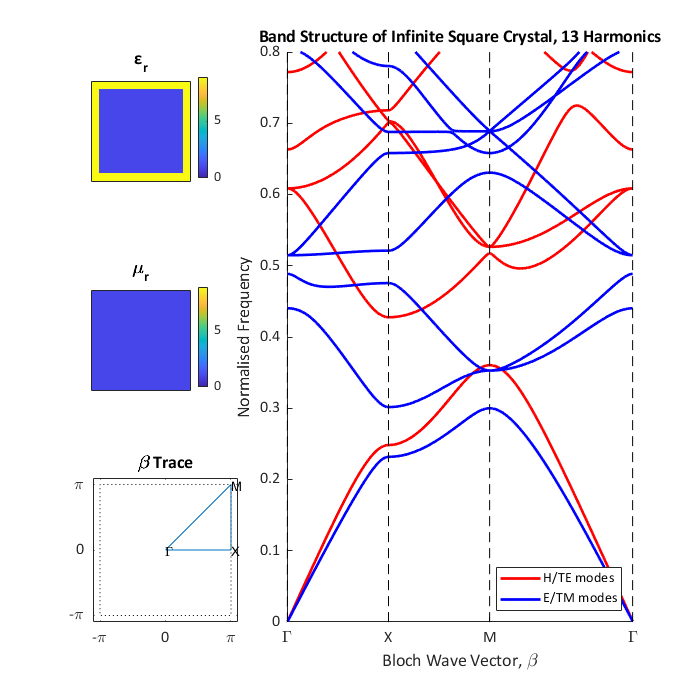

# Calculating the Band Structure of Photonic Crystals

## What Is This?
This repository contains a subset of the code developed and used during my Physics Master's project at Imperial College London. Over the course of the project, I implemented a few different variants of the Plane Wave Expansion Method (PWEM) to solve Maxwell's equations to compute and display the photonic band structure of photonic crystals.

It was written in MATLAB without using git for version control, as per the preferences of my supervisor.

I have updated some of the scripts from that project to work with MATLAB R2023a, and shared them here for those who may be interested!

## What is the 'band structure' of a photonic crystal? Or a 'photonic crystal' for that matter!
A photonic crystal is much like any other crystal - it consists of some 'unit cell' which is repeated over and over again.
For example a salt crystal's unit cell (NaCl) can be thought of as a cube with a sodium ion sitting at the centre, and a chlorine ion sitting on each vertex.

The difference with a photonic crystal however, is that the variation we are interested in is electromagnetic.
Every material has some electric permittivity, ε, and some magnetic permeability, μ, and so any repeating structure composed of two or more materials will be a photonic crystal.

These photonic crystals are interesting, as light travelling through a photonic crystal will interact with, and be partially reflected off every unit cell boundary.
Light is a wave, and so can constructively and destructively interfere with every one of those reflections.
Therefore, the ways that light can travel through a photonic crystal can be very strongly limited, or indeed blocked entirely for some frequencies.

The band structure of a photonic crystal is a way of showing how different frequencies of light are able to travel through the crystal.
For any given direction for light to travel through the crystal (wave-vector), only very specific frequencies can propogate. 
Imagine that for an infinitely large crystal, even a miniscule destructive interference between adjacent unit cells will eventually destroy the wave completely. 
We can use the PWEM to calculate what those frequencies are, and see how the allowed frequencies change as we adjust the wave-vector of the light in the crystal.

## So what does this project actually do?
Over the course of my MSci, I implemented a few variants of the PWEM to solve to compute and display the band structure for photonic crystals.
First using a truncated Fourier series for simple geometries, but then using the Fast Fourier Transform (FFT) to allow more arbitrary crystal geometry, and to allow for metamaterials with varying magnetic permeability.

I became fascinated by a quirk when computing the band structure of non-primitive unit cells - i.e. cells that actually consist of 2 or more smaller unit cells.
When computing the band structure for such unit cells, mysterious non-physical bands appear in the band structure, and I began to focus on understanding how, and what these mystery bands were.
The result was that I was able to extend the conventional rectangular PWEM in a couple of ways.

1. I found an implemented a hexagonal FFT algorithm, and restructured the calculations around it to permit the calculation of the band structure for a Hexagonal unit cell.

2. I figured out how to identify the mystery bands in the band structure, and separate them from the physically viable bands.
This allows for near arbitrary primitive unit cells to be calculated, albeit at a cost in memory and compute time over a primitive unit cell.

Unfortunately, I do not have all of the scripts cleaned up and updated to work with MATLAB R2023a.
I will endeavour to continue moupdating scripts, and updating this repository into the future!
